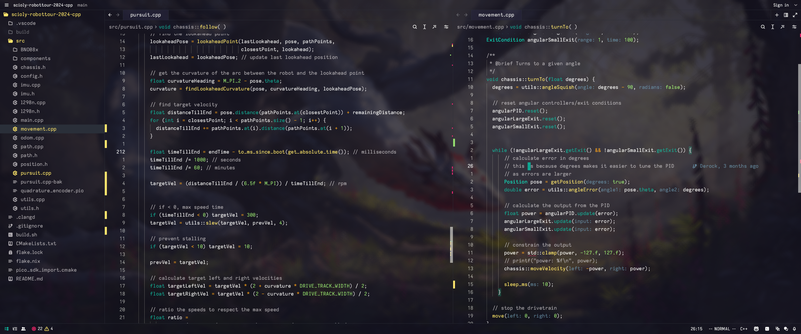

# Derock's Dotfiles

My NixOS configuration lives here. Uses nix flakes. This config serves two hosts, but there are three configs in `./hosts`

| Host | Device | Description |
| --- | --- | --- |
| Galaxy | Laptop | Named galaxy because it's a samsung galaxybook |
| Supernova | Desktop | Named since supernovas are huge explosions, and my desktop is a pretty powerful machine. Big power = big explosion |
| Nebula | Live CD (iso) | Nebulas are where new stars are born, and ISO images are what you use to give life to a computer |

(the little space left of the bar is not visible on the actual screen, i accidentally made screenshot too wide and i cba to fix it 😅)

# Why Nix?
because of its declarative nature, I can easily make configuration changes or install an app on one device and have it on my other device too. This means I basically only have to maintain one system.

## the special stuff
- `pkgs/samsung-galaxybook-extras.nix` - Kernel module derivation that builds the [Samsung Galaxybook platform drivers](https://github.com/joshuagrisham/samsung-galaxybook-extras/tree/main) for fan control among other things.
- `pkgs/intel-ipu6.nix` - My attempt at writing a derivation for Intel's IPU6 drivers. NixOS now has an upstreamed "hardware.ipu6.enable" flag that you should use instead.
- `pkgs/kickoff-dot-desktop.nix` - .desktop file support for the kickoff app

## Building the ISO

as simple as cloning and running `nix build .#nixosConfigurations.nebula.config.system.build.isoImage --show-trace`.  
warning though, it contains all the apps I use so it'll be ~11gb. Minimal version soon:tm:

## some of the tech used
- Hyprland
- Waybar
- Hyprlock
- networkmanager
- wofi
- kickoff
- linux with zen kernel patches
- and too much more
