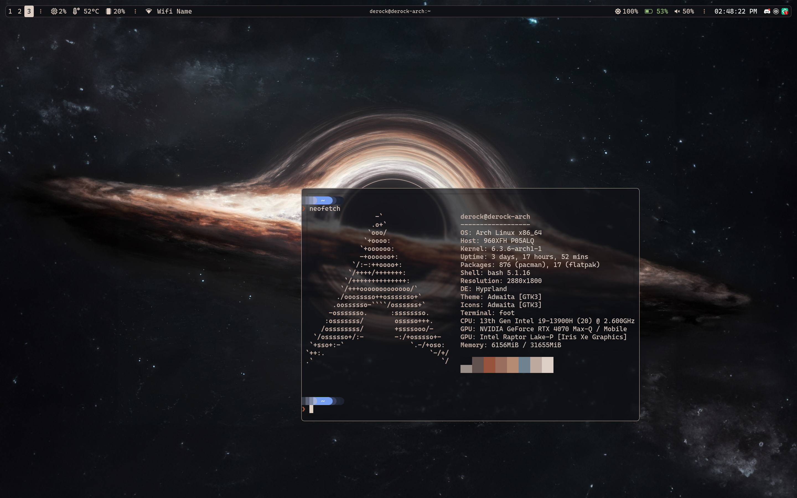

# Derock's Dotfiles

Hi, welcome to my amazing repo which holds the dotfiles to my Arch Linux install.  
This was designed for a laptop.

## Stack
|Type |Software|
|-|-|
|Distro|[Arch Linux](https://archlinux.org/)|
|Window Manager|[Hyprland](https://hyprland.org/)|
|Display Server|[Wayland](https://wayland.freedesktop.org)|
|Status Bar|[Waybar](https://github.com/Alexays/Waybar)|
|Terminal|[foot](https://codeberg.org/dnkl/foot)|
|Launcher|[wofi](https://hg.sr.ht/~scoopta/wofi) (wayland version of rofi)|
|Notifications|[dunst](https://dunst-project.org)|
|Terminal Prompt|[Starship](https://starship.rs)|

## Screenshots
Uses [`pywal`](https://github.com/dylanaraps/pywal) to automatically generate a color palette based on wallpaper.

## Keybindings
See the [config](./.config/hypr/hyprland.conf) for hyprland.
